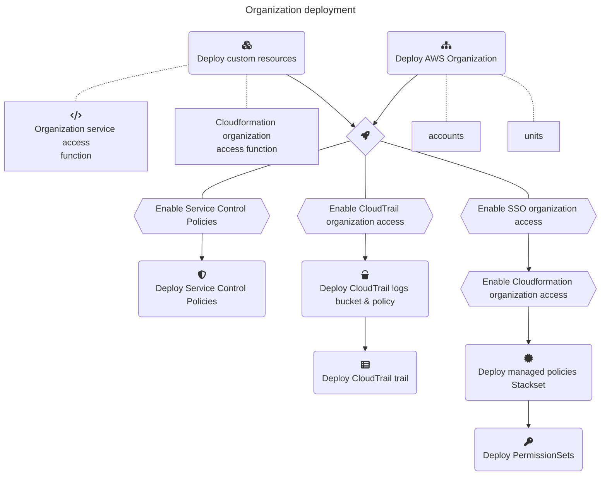

# Lab.AWS.Organizations

A basic setup of an AWS Organization with AWS SAM

## Custom Resources for Cloudformation

* Organizations access: [organizations_aws_service_access](src/lambda/organizations_aws_service_access/README.md)
* CloudFormation organizations access: [cloudformation_organizations_access](src/lambda/cloudformation_organizations_access/README.md)


## Architecture


## Development




### Dependencies

1. Install latest AWS CLI https://docs.aws.amazon.com/cli/latest/userguide/getting-started-version.html
2. Install AWS SAM CLI https://docs.aws.amazon.com/serverless-application-model/latest/developerguide/install-sam-cli.html
3. Install Python 3.9
3. Install jq


### Recommended Visual Studio Code plugins

* https://marketplace.visualstudio.com/items?itemName=tamasfe.even-better-toml
* https://marketplace.visualstudio.com/items?itemName=redhat.vscode-yaml
* https://marketplace.visualstudio.com/items?itemName=yzhang.markdown-all-in-one


## Deployment

For instructions regarding SAM, see https://docs.aws.amazon.com/serverless-application-model/latest/developerguide/using-sam-cli.html.

### SAM build

```sh
cd src
```

```sh
# Build template
sam build
```

### SAM deploy

1. Copy `organization.tmpl.yml` to `organization.yml` and define organizational units and accounts.
2. Deploy organization without SSO (ommit parameter `identityCenterInstanceArn`!):
    ```sh
    sam deploy --config-env prod --parameter-overrides "organizationEmail=aws@your-domain.tld"
    ```

3. Enable Identity Center in AWS Organizations console https://us-east-1.console.aws.amazon.com/organizations/v2/home/services/AWS%20IAM%20Identity%20Center%20(AWS%20Single%20Sign-On)
4. Enable Identity Center in IAM Identity center console https://eu-central-1.console.aws.amazon.com/singlesignon/home?region=eu-central-1#!/
5. Enable Service Control Policies https://us-east-1.console.aws.amazon.com/organizations/v2/home/policies/service-control-policy
6. Get identity center instance ARN
    ```sh
    aws sso-admin list-instances --region eu-central-1 | jq '.Instances[0].InstanceArn'
    ```
    
7. Deploy permission sets, roles, etc (replace the ARN with the output from 4)
    ```sh
    sam deploy --config-env prod --parameter-overrides \
        "organizationEmail=aws@your-domain.tld" \
        "identityCenterInstanceArn=arn:aws:sso:::instance/ssoins-***"
    ```

    Alternatively a `samparameters.json` file can be created (see template `samparameters.tmpl.json`)
    and the parameters can be injected when deploying (Change `.prod` to corresponding environment):
    ```sh
    sam deploy --config-env prod --parameter-overrides \
        $(cat samparameters.json | jq -r '.prod | to_entries | map([.key, .value]|join("=")) | join(" ")')
    ```

8. Create users and assign them to accounts and permission sets https://eu-central-1.console.aws.amazon.com/singlesignon/home?region=eu-central-1#!/instances/6987d2e11148f607/users


### Get outputs

```sh
# Stack outputs
sam list stack-outputs --stack-name organization
```

### Cleanup

```sh
# Delete stack
sam delete --config-env prod
# or
aws cloudformation delete-stack --stack-name organization

# Cleanup the ORG
aws organizations delete-organization

# To remove all SAM resources completely, the SAM bucket needs to be emptied and the stack aws-sam-cli-managed-default needs to be deleted
# see https://towardsthecloud.com/aws-cli-empty-s3-bucket
sam_bucket=$(aws cloudformation describe-stack-resource --stack-name aws-sam-cli-managed-default --logical-resource-id SamCliSourceBucket | jq -r '.StackResourceDetail.PhysicalResourceId')
aws s3 rm "s3://$sam_bucket" --recursive
aws s3api delete-objects \
    --bucket "$sam_bucket" \
    --delete "$(aws s3api list-object-versions \
        --bucket $sam_bucket | \
        jq '{Objects: [.Versions[] | {Key:.Key, VersionId : .VersionId}], Quiet: false}' \
    )"
aws s3api delete-objects \
    --bucket "$sam_bucket" \
    --delete "$(aws s3api list-object-versions \
        --bucket $sam_bucket | \
        jq '{Objects: [.DeleteMarkers[] | {Key:.Key, VersionId : .VersionId}], Quiet: false}' \
    )"
aws cloudformation delete-stack --stack-name aws-sam-cli-managed-default
```
