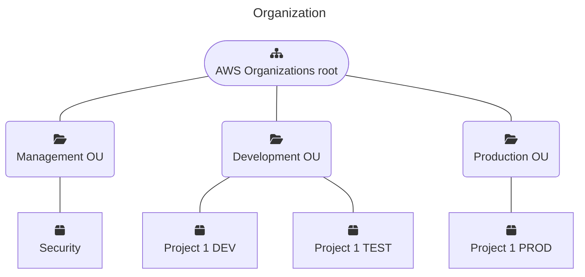
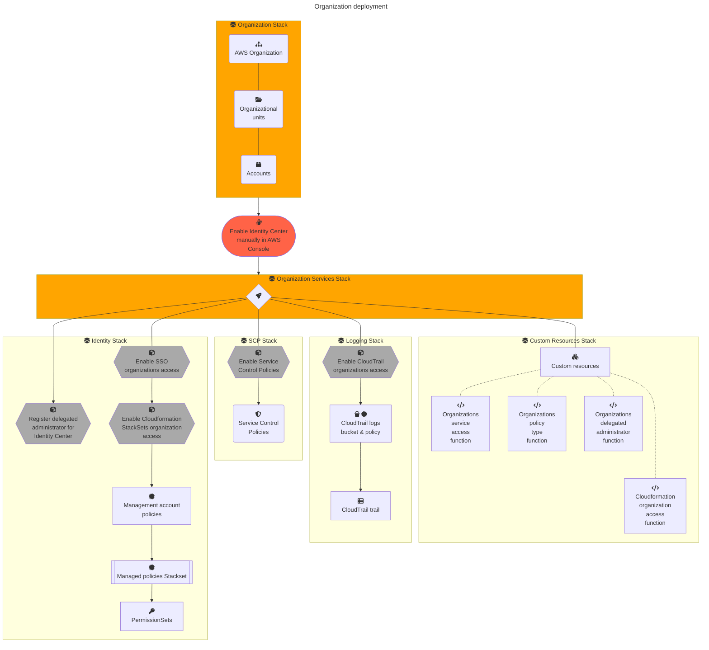

# Lab.AWS.Organizations

A basic setup of an AWS Organization with AWS SAM.

Key concepts see https://docs.aws.amazon.com/organizations/latest/userguide/orgs_getting-started_concepts.html .


## Custom Resources for Cloudformation

CloudFormation is missing some key resources for managing AWS Organizations.
These are covered by the following custom resources:

* Organizations service access: [organizations_aws_service_access](src/custom-resources/lambda/organizations_aws_service_access/README.md)
* Organizations policy type: [organizations_policy_type](src/custom-resources/lambda/organizations_policy_type/README.md)
* Organizations delegated administrator: [organizations_delegated_administrator](src/custom-resources/lambda/delegated_administrator/README.md)
* CloudFormation StackSets organizations access: [cloudformation_organizations_access](src/custom-resources/lambda/cloudformation_organizations_access/README.md)


## Architecture




## Development




### Dependencies

1. Install latest AWS CLI https://docs.aws.amazon.com/cli/latest/userguide/getting-started-version.html
2. Install AWS SAM CLI https://docs.aws.amazon.com/serverless-application-model/latest/developerguide/install-sam-cli.html
3. Install Python 3.9
3. Install jq


### Recommended Visual Studio Code plugins

* https://marketplace.visualstudio.com/items?itemName=tamasfe.even-better-toml
* https://marketplace.visualstudio.com/items?itemName=redhat.vscode-yaml
* https://marketplace.visualstudio.com/items?itemName=yzhang.markdown-all-in-one


## Deployment

### A - Deployment role deployment

* By AWS Console:
    1. Login to the AWS Console and open [CloudFormation](https://eu-central-1.console.aws.amazon.com/cloudformation/)
    2. Deploy manually the stack from template `deployment-roles.yml`:
       * Stack Name: `deployment-roles`
       * Capabilities: `CAPABILITY_IAM`
    3. Extract the role ARNs from the outputs
* By AWS CloudShell:
    1. Login to the AWS Console and open [CloudShell](https://eu-central-1.console.aws.amazon.com/cloudshell/)
    2. Upload the file `deployment-roles.yml`
    3. Deploy the stack:

        ```bash
        aws cloudformation deploy \
            --stack-name deployment-roles \
            --template-file deployment-roles.yml \
            --parameter-overrides environment=prod \
            --capabilities CAPABILITY_IAM
        ```

    4. Extract the role ARNs from the outputs:

        ```bash
        aws cloudformation describe-stacks --stack-name deployment-roles | jq -r '.Stacks[].Outputs'
        ```


### B - Organization deployment (`/organization`)

To allow the import of an existing organization, plain CloudFormation is required, because SAM does not support resource import.

1. Validate template file

    ```bash
    cd organization
    aws cloudformation validate-template --template-body file://
organization.yml
    ```

2. Copy `parameters.tmpl.json` to create a parameters file for the corresponding environment, e.g. `parameters.prod.json`. Update the parameters.
3. Deploy the stack, using the deployment role deployed before (adjust the environment):
   * To deploy a new stack or update an existing one:

        ```bash
        aws cloudformation deploy \
            --stack-name organization \
            --role-arn "arn:aws:iam::123456789000:role/deployment/deployment-roles-OrganizationDeploymentRole-abcdefghijkl" \
            --template-file "organization.yml" \
            --parameter-overrides "file://parameters.prod.json"
        ```

   * If there are existing resources:
        Copy and adjust `resources-to-import.tmpl.json`.

        ```bash
        aws cloudformation create-change-set \
            --stack-name organization \
            --role-arn "arn:aws:iam::123456789000:role/deployment/deployment-roles-OrganizationDeploymentRole-abcdefghijkl" \
            --change-set-type IMPORT \
            --change-set-name import-org \
            --template-body "file://organization.yml" \
            --parameters "$(jq -c . parameters.prod.json)" \
            --resources-to-import "file://resources-to-import.prod.json"
        ```

        ```bash
        aws cloudformation describe-change-set \
            --change-set-name import-org \
            --stack-name organization
        ```

        ```bash
        aws cloudformation execute-change-set \
            --change-set-name import-org \
            --stack-name organization
        ```


## C Organization services deployment `/organization-services`

For instructions regarding SAM, see https://docs.aws.amazon.com/serverless-application-model/latest/developerguide/using-sam-cli.html.

### SAM build

```sh
cd src/organization-services
```

```sh
# Build template
sam build
```

### SAM deploy

1. Enable Identity Center in IAM Identity center console https://eu-central-1.console.aws.amazon.com/singlesignon/home?region=eu-central-1#!/

    **26/06/24**: AWS support confirmed that there is no support to enable IAM Identity Center programatically:

    > Unfortunately, I sincerely regret to convey that enabling AWS IAM Identity Center via API/CLI/boto3 calls is currently not supported. At the moment, there is no alternative method to enable IAM Identity Center other than via the AWS management console. 

3. Get identity center instance ARN
    ```sh
    aws sso-admin list-instances --region eu-central-1 | jq '.Instances[0].InstanceArn'
    ```
    
4. Deploy permission sets, roles, etc (replace the ARN with the output from 4)
    ```sh
    sam deploy --config-env prod \
        --role-arn "arn:aws:iam::123456789000:role/deployment/deployment-roles-OrganizationServicesDeploymentRole-abcdefghijkl" \ --parameter-overrides \
        "organizationEmail=aws@your-domain.tld" \
        "identityCenterInstanceArn=arn:aws:sso:::instance/ssoins-***"
    ```

    Alternatively a `samparameters.json` file can be created (see template `samparameters.tmpl.json`)
    and the parameters can be injected when deploying (Change `.prod` to corresponding environment):
    ```sh
    sam deploy --config-env prod \
        --role-arn "arn:aws:iam::123456789000:role/deployment/deployment-roles-OrganizationServicesDeploymentRole-abcdefghijkl" \
        --parameter-overrides \
        $(cat samparameters.json | jq -r '.prod | to_entries | map([.key, .value]|join("=")) | join(" ")')
    ```

5. Create users and assign them to accounts and permission sets https://eu-central-1.console.aws.amazon.com/singlesignon/home?region=eu-central-1#!/instances/6987d2e11148f607/users


### Get outputs

```sh
# Stack outputs
sam list stack-outputs --stack-name organization
```

### Cleanup

```sh
# Delete stack
sam delete --config-env prod
# or
aws cloudformation delete-stack --stack-name organization

# Cleanup the ORG
aws organizations delete-organization

# To remove all SAM resources completely, the SAM bucket needs to be emptied and the stack aws-sam-cli-managed-default needs to be deleted
# see https://towardsthecloud.com/aws-cli-empty-s3-bucket
sam_bucket=$(aws cloudformation describe-stack-resource --stack-name aws-sam-cli-managed-default --logical-resource-id SamCliSourceBucket | jq -r '.StackResourceDetail.PhysicalResourceId')
aws s3 rm "s3://$sam_bucket" --recursive
aws s3api delete-objects \
    --bucket "$sam_bucket" \
    --delete "$(aws s3api list-object-versions \
        --bucket $sam_bucket | \
        jq '{Objects: [.Versions[] | {Key:.Key, VersionId : .VersionId}], Quiet: false}' \
    )"
aws s3api delete-objects \
    --bucket "$sam_bucket" \
    --delete "$(aws s3api list-object-versions \
        --bucket $sam_bucket | \
        jq '{Objects: [.DeleteMarkers[] | {Key:.Key, VersionId : .VersionId}], Quiet: false}' \
    )"
aws cloudformation delete-stack --stack-name aws-sam-cli-managed-default
```


## Administration

### Switch role to access `OrganizationAccountAccess` of a member account

Use a user with Administrator permissions or an IAM user participating in the IAM group `ManagementAdministrator` to get the permissions to switch role.

See https://docs.aws.amazon.com/organizations/latest/userguide/orgs_manage_accounts_access.html#orgs_manage_accounts_access-cross-account-role