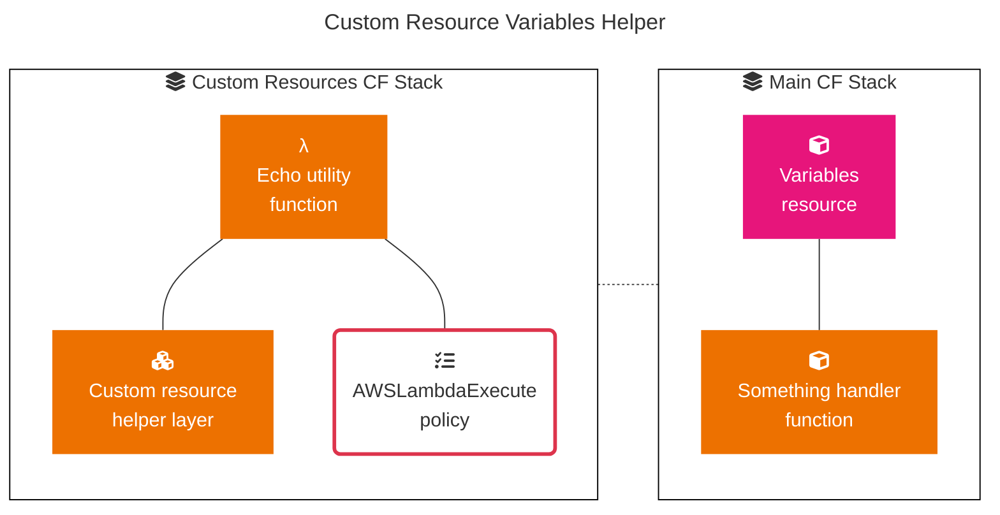

# Echo utility - Declare variables



## Syntax

To declare this entity in your AWS CloudFormation template, use the same syntax as Custom Resources.
See https://docs.aws.amazon.com/AWSCloudFormation/latest/UserGuide/aws-resource-cloudformation-customresource.html.

### YAML

```yaml
Type: Custom::EchoUtility # or AWS::CloudFormation::CustomResource
Properties:
  ServiceTimeout: String
  ServiceToken: String
  ...
```


## Properties

For `ServiceTimeout` and `ServiceToken` see AWS documentation: https://docs.aws.amazon.com/AWSCloudFormation/latest/UserGuide/aws-resource-cloudformation-customresource.html#aws-resource-cloudformation-customresource-properties.

### `...`

Any property you would like to define

*Required*: No  

*Type*: String  


## Return values

### Ref

When you pass the logical ID of this resource to the intrinsic `Ref` function, `Ref` returns an ID, generated by CR helper.

### Fn::GetAtt

The `Fn::GetAtt` intrinsic function returns a value for a specified attribute of this resource.
Every property provided in `Properties` can be retrieved by `Fn::GetAtt`.


## Examples

### Declare variables

#### YAML

```yaml
# Cloudformation template.yml

# ...

Resources:
  Variables:
    Type: Custom::EchoUtility
    Properties:
      ServiceToken: !Ref echoUtilityFunctionArn
      ServiceTimeout: 10
      namePrefix: magic
      functionDirectory: ./lambda
      powertoolsLayer: !Sub "arn:aws:lambda:${AWS::Region}:017000801446:layer:${powertoolsNameVersion}"

  SomethingHandlerFunction:
    Type: AWS::Serverless::Function
    Properties:
      FunctionName: !Sub
        - "${prefix}-something-handler"
        - prefix: !GetAtt Variables.namePrefix
      Description: Register/deregister an organizations delegated administrator
      Handler: index.handler
      CodeUri: !Sub
        - "${directory}/something-handler/src"
        - directory: !GetAtt Variables.functionDirectory
      Layers:
        - !GetAtt Variables.powertoolsLayer
```
